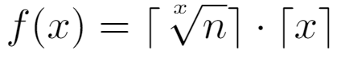

# Solution: Poison Wine

I did not have the most optimal solution to this problem, but wanted to share my approach since it differed significantly from the usual method using binary digits. 

Given our 1000 bottles of wine, or even n bottles, we could first form a square, and assign 32 servants (ceil(sqrt(1000)) = 32) to each dimension (2 dimensions for a square). Each servant drinks some of each wine in their row or column, and the 2 servants that die will pinpoint the exact coordinate of our poisoned wine. A total of 72 servants used.

Now before we expand on the way I thought of this, why a square? A square will simply maximize the area for a minimum L and W compared to a rectangle. The same applies for higher dimensions.

Since we used a geometrtical approach using a square, we can expand this to higher dimensions. With 3 dimensions, we need 10 servants per dimension (10 * 10 * 10 = 1000), 30 total. This process can continue for higher dimensions. 

Formally, we want to minimize this function:

for n bottles of wine.

Although this solution is not optimal, for 1 poisoned bottle, it will always kill x servents, where the binary approach could kill none, or all (for each bit).